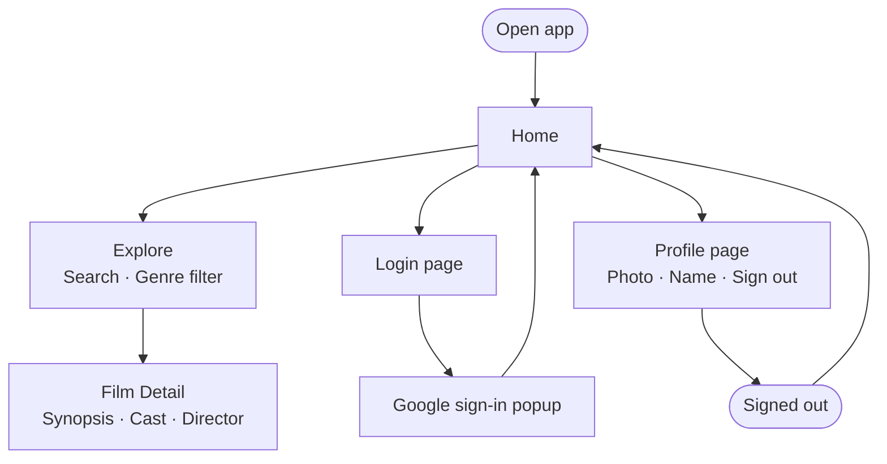
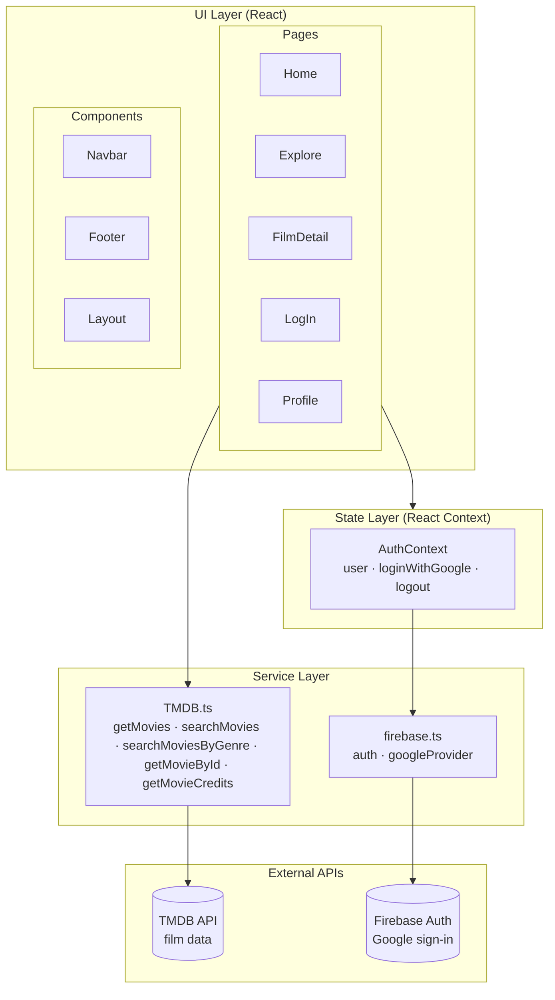

# The Film Shelf

A film discovery web app built with React, TypeScript, and Firebase.

## Features

- **Home** — landing page with app introduction
- **Explore** — search films by title or filter by genre via TMDB API
- **Film detail** — synopsis, cast, and director
- **Authentication** — Google sign-in via Firebase Auth
- **Profile** — user info and sign out

---

## User flow



---

## Architecture



---

## Tech stack

| Layer | Technology |
|---|---|
| UI | React 19 + TypeScript |
| Routing | React Router v7 |
| Styles | Tailwind CSS |
| Auth | Firebase Authentication (Google) |
| Film data | TMDB API v3 |
| Build | Vite |
| Tests | Vitest |

---

## Getting started

### 1. Clone the repo

```bash
git clone https://github.com/juannarowe/the-film-shelf.git
cd the-film-shelf
npm install
```

### 2. Set environment variables

Create a `.env` file at the root:

```env
VITE_TMDB_API_KEY=your_tmdb_api_key

VITE_FIREBASE_API_KEY=...
VITE_FIREBASE_AUTH_DOMAIN=...
VITE_FIREBASE_PROJECT_ID=...
VITE_FIREBASE_STORAGE_BUCKET=...
VITE_FIREBASE_MESSAGING_SENDER_ID=...
VITE_FIREBASE_APP_ID=...
```

- **TMDB key**: create a free account at [themoviedb.org](https://www.themoviedb.org/) → Settings → API.
- **Firebase**: create a project at [console.firebase.google.com](https://console.firebase.google.com/) and enable Authentication (Google provider).

### 3. Run locally

```bash
npm run dev
```

### 4. Run tests

```bash
npm run test
```

---

## Project structure

```
src/
├── components/
│   ├── Navbar.tsx         # Navigation bar (auth-aware)
│   ├── Footer.tsx
│   └── Layout.tsx
├── context/
│   └── AuthContext.tsx    # Firebase Auth state + loginWithGoogle/logout
├── pages/
│   ├── Home.tsx
│   ├── Explore/           # Search and genre filter
│   ├── FilmDetail/        # Film info and cast
│   ├── LogIn/             # Google sign-in
│   └── Profile/           # User info and sign out
├── services/
│   ├── firebase.ts        # Firebase initialisation
│   └── TMDB.ts            # TMDB API functions
├── testing/
│   ├── getImageUrl.test.ts
│   └── filterMoviesByTitle.test.ts
├── types/
│   └── movie.ts           # TypeScript interfaces
└── utils/
    ├── getImageUrl.ts
    └── filterMoviesByTitle.ts
```
